.. vim: syntax=rst

docx批量转rst方法
======================

按章分割word文档
------------------

1.将所需转换的文档放入一个新的文件夹中

2.打开文档，进入大纲视图

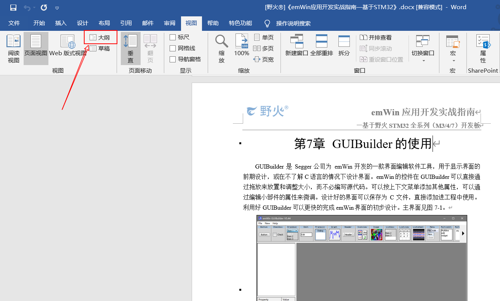

3.合理选择显示级别，取消显示文本格式的选项后将显示本文档所有的章节名

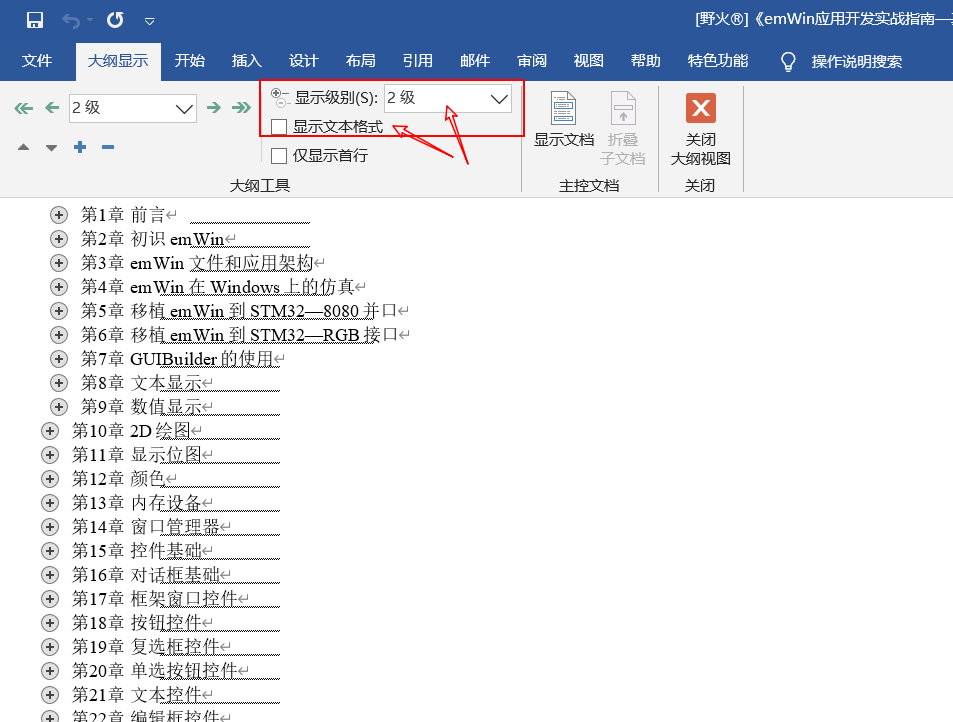

4.点击第n章前的加号按钮，选中本章，点击显示文档按钮，出现创建选项

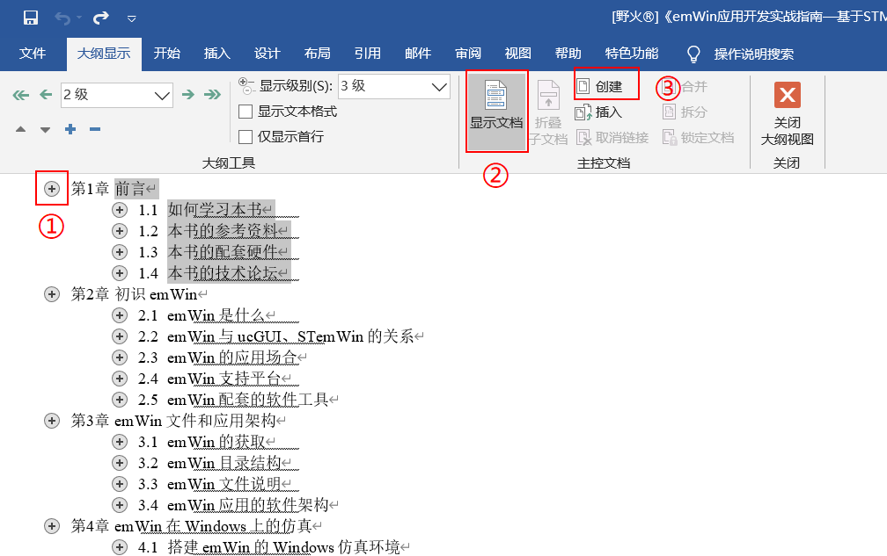

5.点击创建按钮之后如图所示

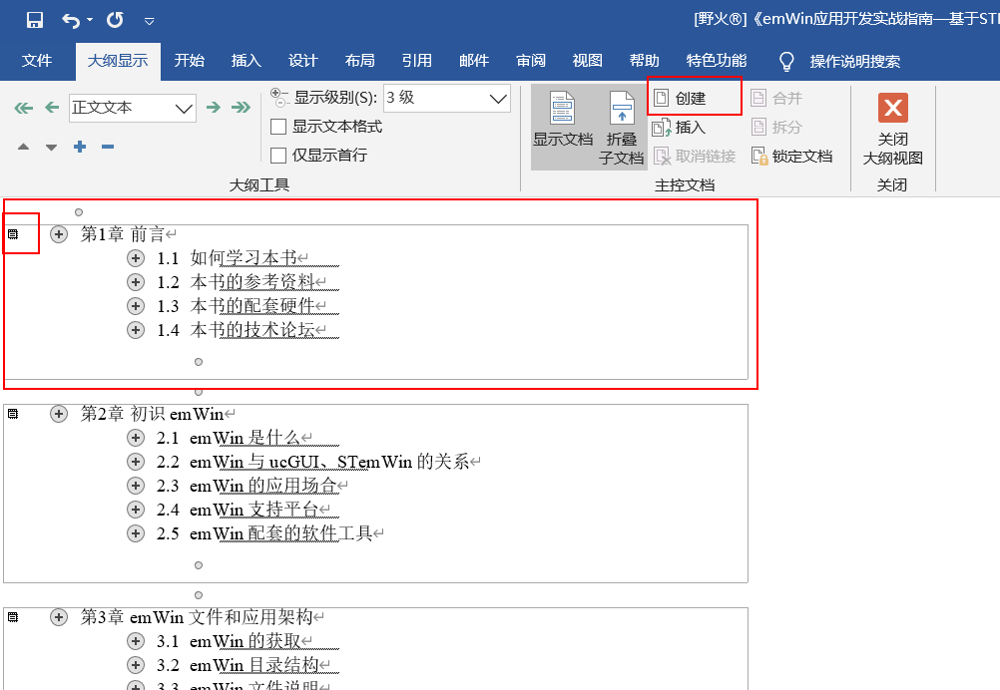

6.所有章都按上述方法操作，点击保存

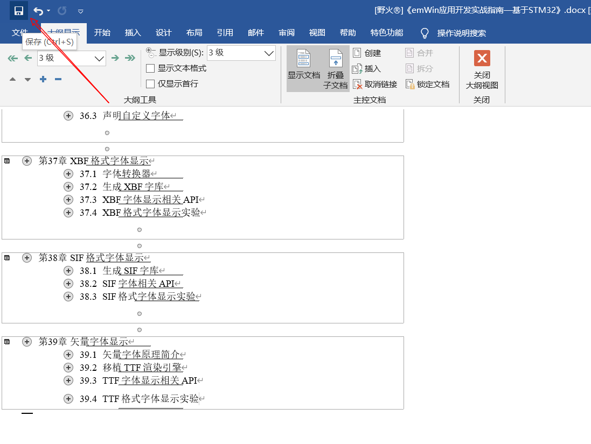

7.文件夹中就出现了分割好的单独docx格式的文件，删除原来整本的文档

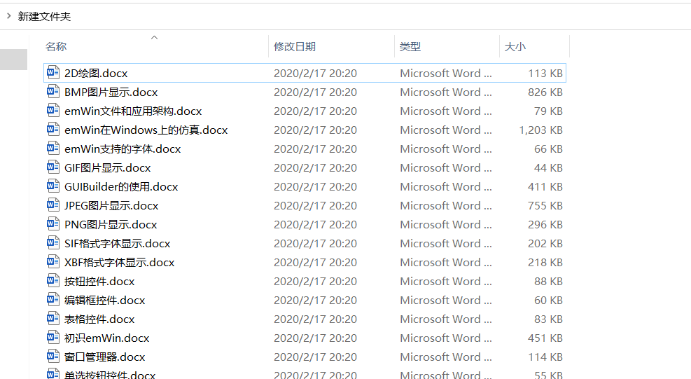

批量将分割后的docx转换为rst
-----------------------------

1.将分割后的文件改成对应的英文名以方便转换

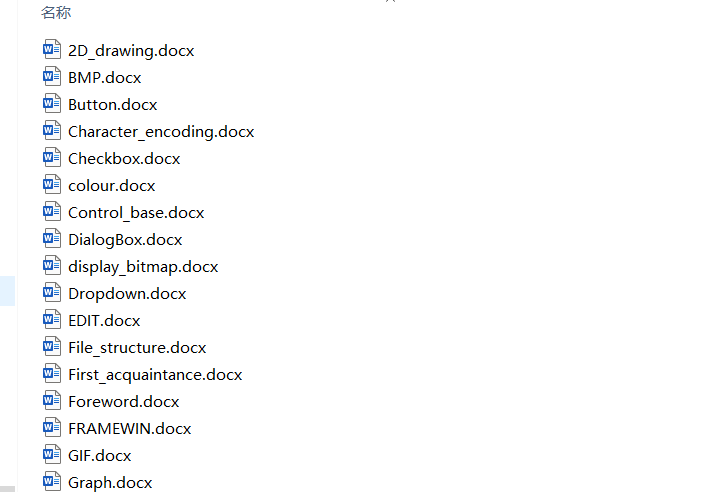

2.新建一个文本文档，内容如下，获取当前列表中的文件名

.. highlight:: sh

::

    DIR *.* /B >LIST.TXT

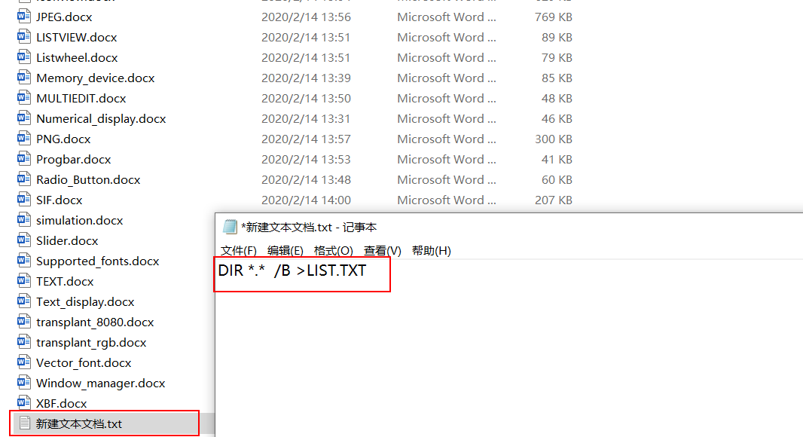

3.将新建文本文档的后缀名改为 .bat后双击运行得到 了LIST.TXT ，

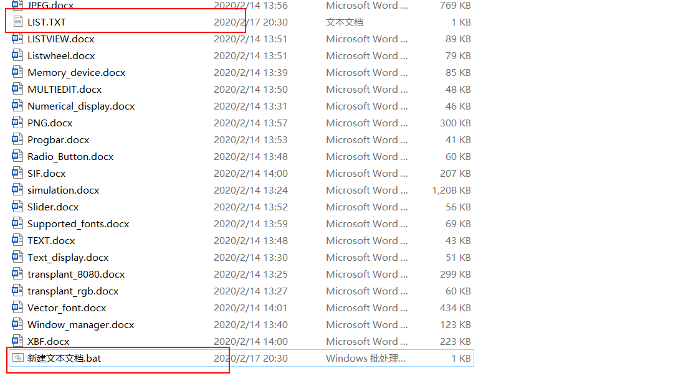

4.用notepad++打开LIST.TXT,删除图中的两行

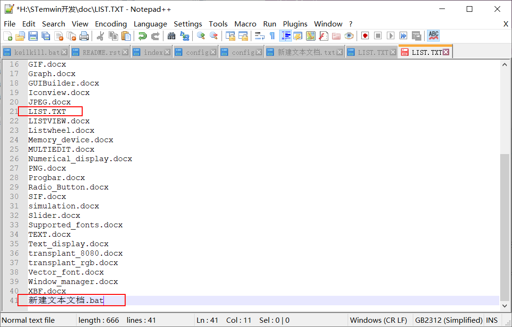

5.鼠标：alt+鼠标左键选择中所有的行。键盘：alt+shift+方向鍵将位置调整到行首。输入rstfromdocx -lurg 后保存。

.. highlight:: sh

::

    rstfromdocx -lurg

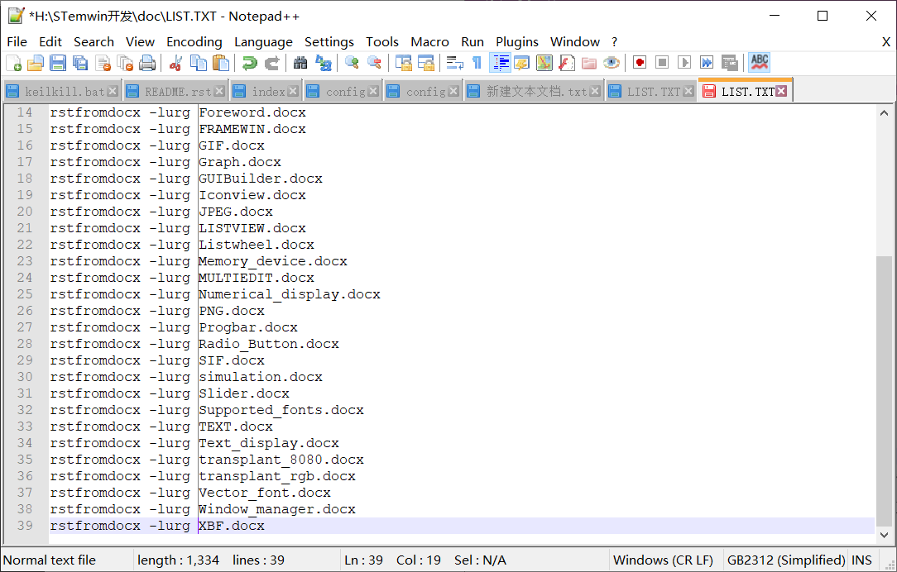

6.在文档所在的文件夹按住shift键和点击鼠标右键，选中打开powershell，

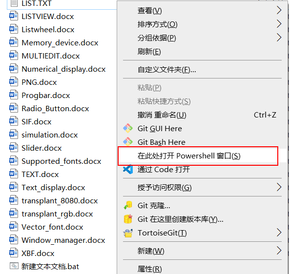

7.全选上面编辑好的文档列表然后复制到powershell中，鼠标右键复制，文档开始转换

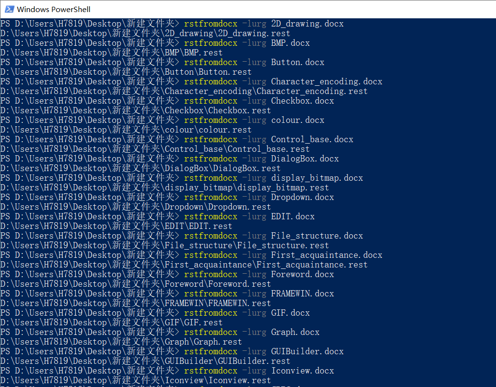

8.完成后就得到了转换好的文件，将转换好的文件复制到一个新文件夹中，防止接下来的操作失败，注意备份

批量将.rest修改为.rst并删除不需要的文件
-----------------------------------------

1.在新文件夹中新建一个.bat文件，并复制以下内容保存后运行

.. highlight:: sh

::

    del *.py /s
    del index.rest /s
    del Makefile /s

    for /f "tokens=* delims=" %%i in ('dir /b /a-d /s "*.rest"') do (move "%%i" "%%~dpi./../")
    for /f "tokens=* delims=" %%i in ('dir /b /a-d /s "*.png"') do (move "%%i" "%%~dpi./../")
    for /f "tokens=* delims=" %%i in ('dir /b /a-d /s "*.jpeg"') do (move "%%i" "%%~dpi./../")
    for /f "tokens=* delims=" %%i in ('dir /b /a-d /s "*.jpg"') do (move "%%i" "%%~dpi./../")
    for /f "tokens=* delims=" %%i in ('dir /b /a-d /s "*.bmp"') do (move "%%i" "%%~dpi./../")

    echo.
    echo 正在删除当前目录及子目录中所有的空文件夹，请稍后......
    echo -------------------------------------------------------------
    cd. > listnull.txt
    for /f "delims=" %%i in ('dir /ad /b /s') do (
    dir /b "%%i" | findstr .>nul || echo %%i >> listnull.txt
    )

    set /a sum=0
    for /f "tokens=*" %%i in (listnull.txt) do (
    rd /q "%%i"
    echo 成功删除空目录：%%i
    set /a sum=sum+1
    )

    echo -------------------------------------------------------------
    echo 共成功删除%cd%目录及其子目录下%sum%个空文件夹！
    echo.
    set sum=

    ren *.rest *.rst

    del listnull.txt

    exit

上述代码的作用是删除不需要的文件和空文件夹，并将图片文件移动到上一级目录下，然后将rest更名为rst

2.新建一个media文件夹，并将存放图片的文件夹移动至media文件夹，至此，批量转换完成

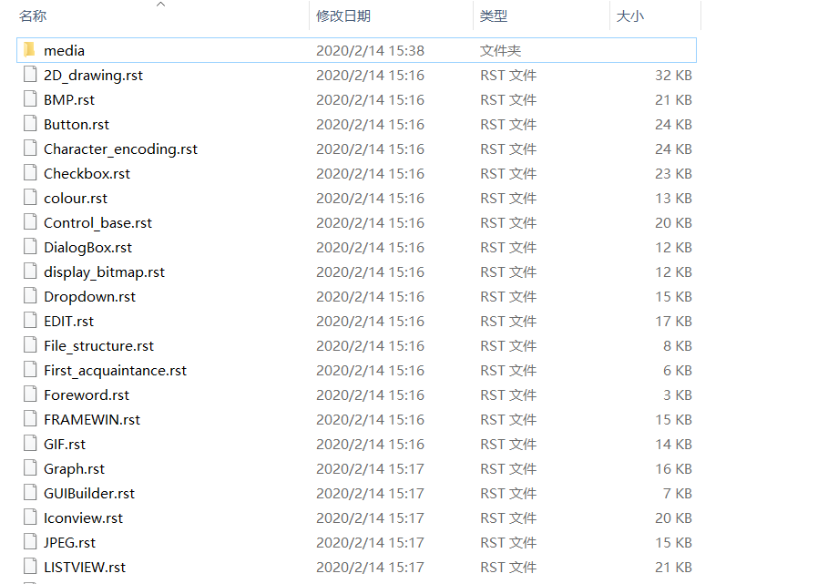

