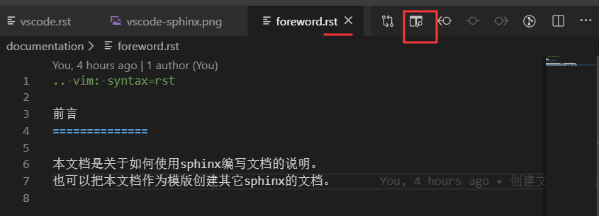
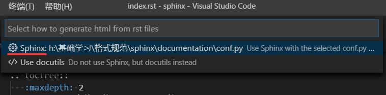
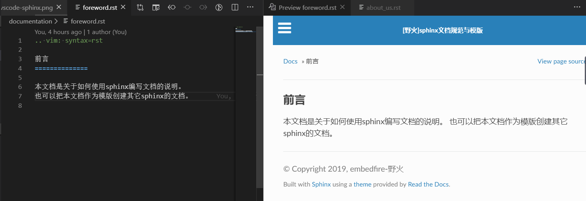

.. vim: syntax=rst

使用vscode编写rst文件
==========================================

使用vscode编写sphinx文档非常方便，可以即时预览和自动编译。

rst vscode插件说明页：https://docs.restructuredtext.net/index.html

另外，vscode默认支持markdown单个文件的预览。

reStructuredText插件
-------------------------------

需要安装的vscode插件：

- python
- reStructuredText

安装python插件后，要选择使用python3的解释器，不要使用python2。

安装reStructuredText插件后，打开rst文件，点击预览按钮。

会提示使用sphinx还是doctuil工具，我们选择使用sphinx。

若配置正确，稍等一会即可在右侧看到预览效果。

Table Formater插件
----------------------------
使用Table Formater可以方便格式化表格，支持markdown和rst
https://marketplace.visualstudio.com/items?itemName=shuworks.vscode-table-formatter

插件名：Table Formatter

安装后通过Ctrl-Shift-P调用 Table: Format Current 或 Table: Format All
